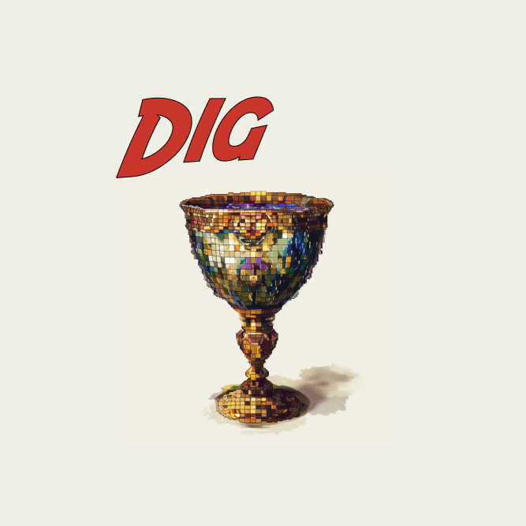

*Dig* is a Farcaster frame game where you click a button to have an NFT transferred to you. There is also a contract that stores ERC 20 tokens and at a random time every Monday pays the current holder 1k tokens from the available pool. There is a [leaderboard](https://warpcast.com/sean07.eth/0x6b30e693) of top 5 diggers throughout the week. If you're holding the NFT at the random time and win the payout, you'll receive double the tokens (2k).

Tokens in the ERC 20 contract must be whitelisted to avoid diggers getting spammy tokens. Current whitelisted tokens are degen, tn100x, mfercoin and higher.

We play until the ETH for gas in the NFT wallet on Ham chain runs out, or the token balance in the ERC 20 contract runs out.

[Website](https://www.dig.bingo)

[Frame](https://warpcast.com/sean07.eth/0x6dd8a5a4)

ERC 721 contract deployed to the Ham blockchain [here](https://explorer.ham.fun/address/0x142407b2D618f7DA94bE2194f426B532f3405949). Code is [here](./contracts/dig.sol)

Contract for holding ERC 20s and transferring the winner is deployed on Base [here](https://basescan.org/address/0x156c132c93ce88bbab04313ef456f093d6957409). Code is [here](./contracts/tokens.sol).